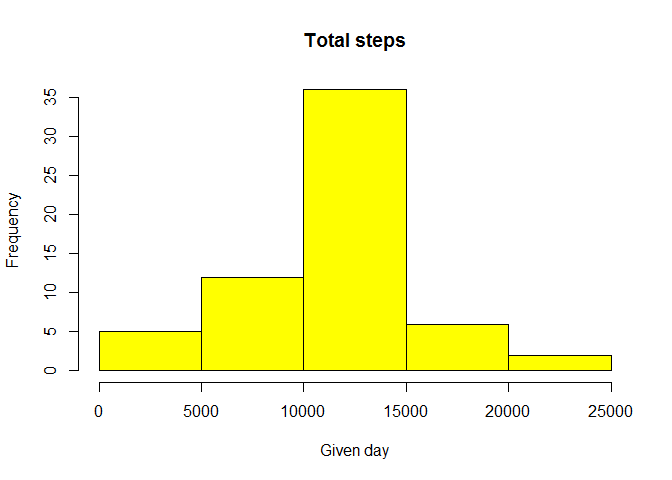
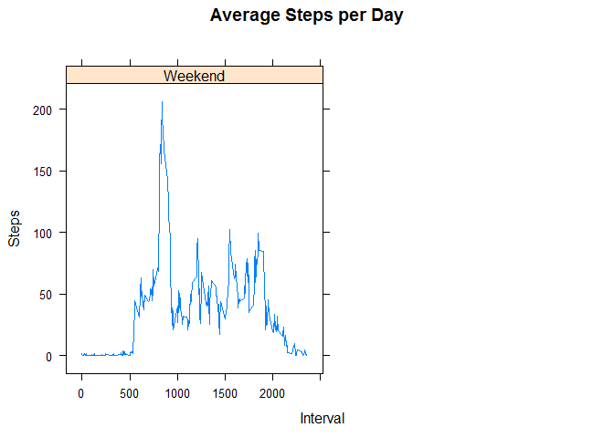

# Reproducible Research: Peer Assessment 1


```r
library(lattice)
```

## Loading and preprocessing the data

```r
Fitbit<- read.csv("activity.csv", colClasses = c("numeric", "character", 
                                                    "numeric"))
Fitbit$date <- as.Date(Fitbit$date, "%Y-%m-%d")
str(Fitbit)
```

```
## 'data.frame':	17568 obs. of  3 variables:
##  $ steps   : num  NA NA NA NA NA NA NA NA NA NA ...
##  $ date    : Date, format: "2012-10-01" "2012-10-01" ...
##  $ interval: num  0 5 10 15 20 25 30 35 40 45 ...
```
## What is mean total number of steps taken per day?

```r
NumberOfSteps<- aggregate(steps ~ date, data = Fitbit, sum, na.rm = TRUE)
hist(NumberOfSteps$steps, main = "Total steps", xlab = "Given day", col = "Blue")
```

 

```r
DailyMean <- mean(NumberOfSteps$steps)
DailyMedian  <- median(NumberOfSteps$steps)
DailyMean
```

```
## [1] 10766.19
```

```r
DailyMedian
```

```
## [1] 10765
```

`DailyMean` is the mean and `DailyMedian` is the median

## What is the average daily activity pattern?

```r
DailyPattern<- aggregate(steps ~ interval, data = Fitbit, mean, na.rm = TRUE)
plot(DailyPattern$interval,DailyPattern$steps, type="l", xlab="Interval", ylab="StepNumber",main="Mean number of steps per day by interval")
```

 

```r
MaxInterval <- DailyPattern[which.max(DailyPattern$steps),1]
MaxInterval
```

```
## [1] 835
```

`MaxInterval` is the 5-minutes maximum interval

## Imputing missing values


```r
Missing_values<- sum(is.na(Fitbit))

FullData <- transform(Fitbit, 
                      steps = ifelse(is.na(Fitbit$steps), 
                                     DailyPattern$steps[match(Fitbit$interval, 
                                                              DailyPattern$interval)], 
                                     Fitbit$steps))
NumberOfSteps2<- aggregate(steps ~ date, data = FullData, sum, na.rm = TRUE)
hist(NumberOfSteps2$steps, main = "Total steps", xlab = "Given day", col = "Yellow")
```

 

```r
DailyMean2 <- mean(NumberOfSteps2$steps)
DailyMedian2  <- median(NumberOfSteps2$steps)
DailyMean2 
```

```
## [1] 10766.19
```

```r
DailyMedian2
```

```
## [1] 10766.19
```
`DailyMean2` is the  new mean and `DailyMedian2` is the  new median. Latest has been changed.

## Are there differences in activity patterns between weekdays and weekends?

```r
weekdays <- c("Monday", "Tuesday", "Wednesday", "Thursday", "Friday")
FullData$IsWeekend = as.factor(ifelse(is.element(weekdays(as.Date(FullData$date)),weekdays), "Weekday", "Weekend"))

DailyPattern2<- aggregate(steps ~ interval + IsWeekend, FullData, mean)
xyplot(DailyPattern2$steps ~ DailyPattern2$interval|DailyPattern2$IsWeekend, main="Average Steps per Day",xlab="Interval", ylab="Steps",layout=c(2,1), type="l")
```

 

